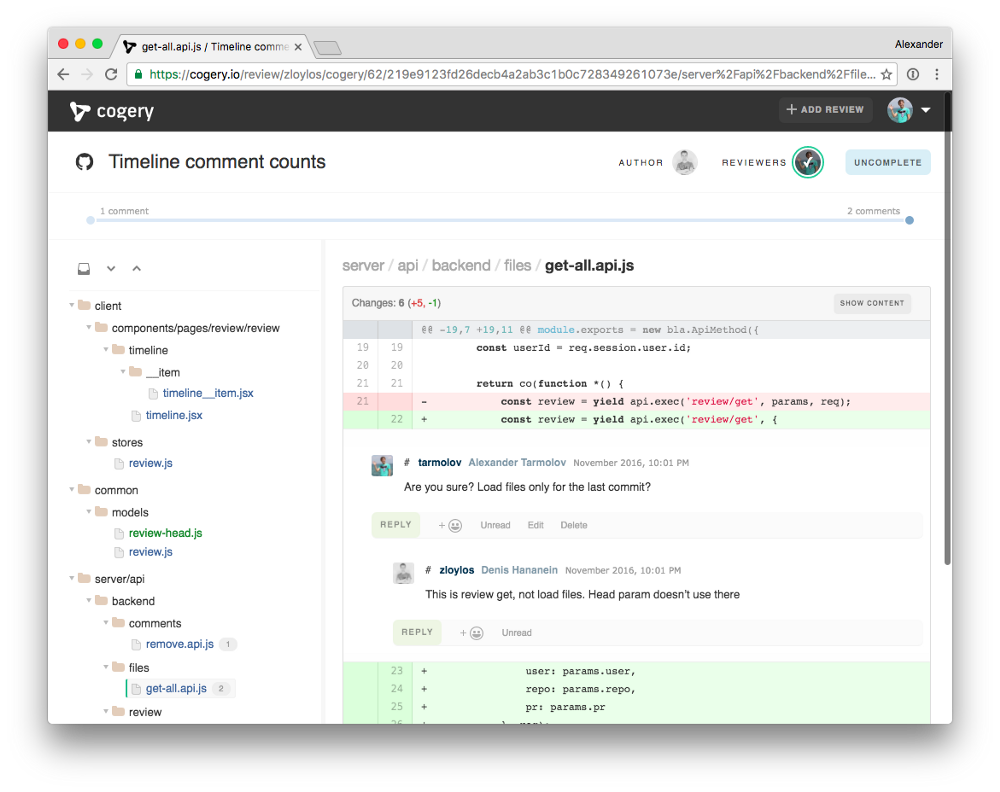
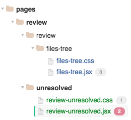
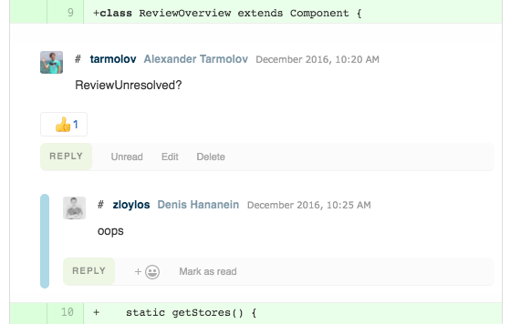
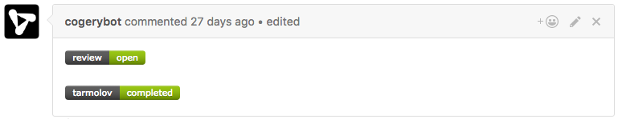

It is not a secret that a code review is a vital part of creating a good software. Sometimes it makes it possible to catch more bugs than other kind of testing. However, code review is time-consuming and energy-expansive because a reviewer spends a lot of mental energy during this process.

“Price” of code review highly depends on a code review tool. We believe that a simple tool with friendly UI is a key for effective code reviews. That’s why we created a new code review tool. We called it [Cogery](https://cogery.io/).

That’s how it looks.

We want to help developers stay focused during code review. So we split the whole diff into files diffs and show a familiar files tree navigation. Modified, added and removed files are highlighted with different colors. It really helps to read a long reviews.

Also we think that a review progress information is very important as well. You, as an review author, usually are interested to know which reviewers are started reading, finished, or in progress of reading. Cogery shows this information in compact way.

During review developers usually do a lot of commenting. So we try to make it fun and handy with threaded conversations, reactions and comments statuses.

Currently it works only with [Github](https://github.com/). Cogery can be integrated to github workflow just with one click. After that the badges will appear for all new pull request automatically.

Of course we know that Github [has its own code review tool](https://github.com/blog/2123-more-code-review-tools). However, we believe that a separate code review tool is more flexible because it provides a specific UI which serves only one goal — code reading and code inspection.

Cogery project is only in the beginning on its way. It’s an alpha and it can be buggy. Please be tolerant ;)

If you want to know all features, check out our [features page](https://cogery.io/features).

We’ve been working hard the last year to ship this alpha version for you. We have a long backlog and we hope to bring more cool features in the next year!
